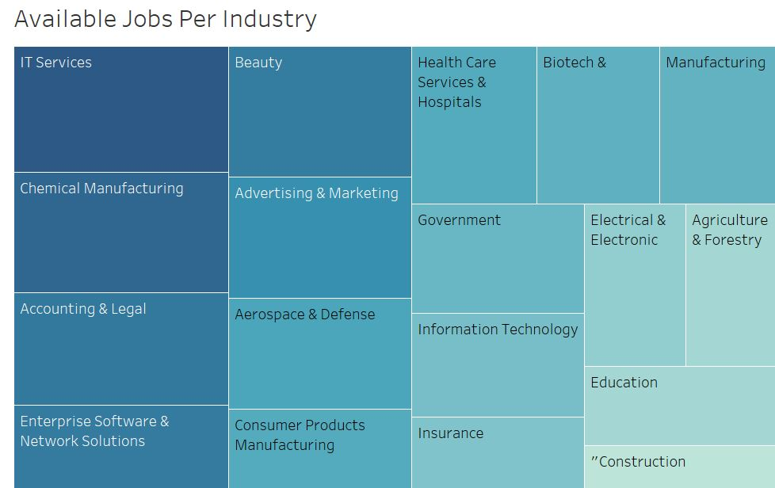
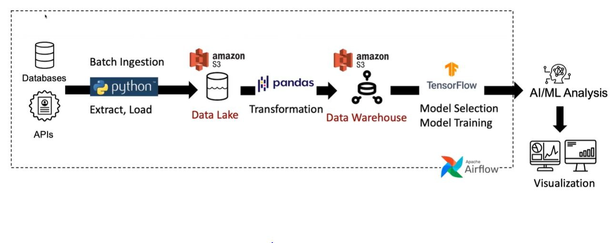

# Glassdoor Data Scientist Dataset / Data Pipeline with Machine Learning
## _Contributors: Christopher Scott Lee, Clint Law, Andy Kim_

## Objective
The project predicts job titles by job description by first creating and implementing a data pipeline to transport job posting data to a datalake hosted in an Apache Airflow instance. It cleans and analyzes the data using widely available Pandas tooks. Next, it uses a Naive Bayesean classifier from scikit-learn to create a predictive model to predict both seniority and sector by job description and location. Finally, we utilize Tableau to create visualizations and dashboards to showcase results. Through collection, transformation, and visualization, the project team makes data supported inferences about the predictive prowess of the model. 

## Dataset
["Data Science Job Posting on Glassdoor"](https://www.kaggle.com/datasets/rashikrahmanpritom/data-science-job-posting-on-glassdoor) is a dataset of data science job posts in glassdoor.

The information was extracted from Glassdoor's website, resulting in two sets of data: uncleaned and cleaned. 

The code section includes web scraping, data cleaning, and exploratory data analysis (EDA) code.

## Pipeline/Architecture
- [Pycharm](https://www.jetbrains.com/pycharm/) for local code development
- [Apache Airflow](https://airflow.apache.org/) for data ingestion
- [AWS](https://aws.amazon.com/) for data lake storage Amazon S3
- [AWS](https://aws.amazon.com/) for containerization Amazon EC2
- [Scikit-learn](https://scikit-learn.org/stable/) machine learning platform
- [Python](https://www.python.org/) (Pandas, NumPy, etc.) for data cleaning and analysis
- [Tableau](https://www.tableau.com/) Desktop for data visualization

## Data Quality Assessment

We conducted exploratory data analysis to understand the dataset's structure, identify patterns, and gain insights into data processing needs. The Glassdoor dataset was comprised of high quality data, although limited in scope to less than 700 job postings from a single year (2020). After analyzing the dataset's structure, we determined this data to be of high quality, although limited in scope to less than 700 job postings from a single year (2020) 

## Data Evaluation, Cleaning, and Transformation: 
Exploratory data analysis (EDA) was used to evaluate the data before making assumptions. EDA facilitated the identification of data errors, outliers, anomalies, and patterns within the data. These data defects were mitigated through the following steps.

- With the Pandas library in Python the dataset was prepared for statisical analysis
- Missing values were identified and removed.
- Duplicate rows were removed to ensure data integrity.
- Outliers were identified and mitigated through statistical methodology.
- Dataset attributes were standardized to a common scale to ensure the evaluation of like terms.
- Stop words were removed from each job description.
- Sparse vectorization based on a bag-of-words was implemented for maching learning.

Data Observations:
- We have no independent way to validate the completeness or accuracy of the input data.
- We cannot verify the authenticity, but the scope and complexity of the data makes it unlikely that substantial 
  parts have been fabricated. Unintentional or intentional exclusion of some data is more plausible.
- The Kaggle repository includes both a cleaned and raw dataset.
- Code for the cleaning steps were included in the repository, providing a means to independently ensure data 
  integrity through this process.

  
## Data Transformation and Machine Learning: 
After analyzing, cleaning, and preparing the dataset for evaluation, the dataset required additional transformation before it is feed into a machine learning model. 

- Text tokenization and sparse vectorization was implemented to breakdown text into meaningful units. 
- Feature extraction identified the target variable and the data attributes that would be utilized to predict 
  the target variable. 
- The data was split into training and testing sets to evaluate the model's performance. 
- A Naive Bayes model was implemented due to its classification prowess using textual data. 
- The machine learning model utilized data splits to develop a comprehensive prediction tool. 
  - The training dataset allowed the model to learn patterns and relationships within the data.
  - The test dataset was used to evaluate the model’s performance on unseen data.
 
## Business Intelligence: 
Through the use of the AWS_DB and Tableau, we were able to connect, analyze, and visualize data from the dataset. Based on the attributes in the dataset, we were able to identify the prevalence of available jobs by industry. Through the dataset's geographical and salary information, we were able to extract the average salary per state.

 
## Setup Instructions: 

- [AWS](https://aws.amazon.com/): Open an AWS account on https://aws.amazon.com. Sign into the console and follow   the instructions to create a new AWS account. 
  - Setup an EC2 Instance(s): Navigate to EC2 service via the AWS Management Console.
    - Click “Launch Instance” to create a new virtual server. 
    - Select an Amazon Machine Image (AMI) to establish an instance type, configure details, add storage, and          review settings.
  - Create S3 Bucket: Navigate to the S3 service via the AWS Management Console. 
    - Click “Create Bucket”, provide a unique name, and configure settings as needed.

- [Apache Airflow](https://airflow.apache.org/): EC2 instance will host Apache Airflow.
    - Connect your EC2 instance using SSH
    - Install Airflow package via pip install apache-airflow 

- [Kaggle](https://www.kaggle.com/docs/api) – Create a Kaggle account and authenticate the API token to download   dataset via the data pipeline.

## Infographic:

In this data pipeline architecture, the Glassdoor dataset serves as the foundation for analysis and machine learning. Leveraging Python, data is extracted and processed to ensure clean and relevant analysis. The processed data is housed in an AWS S3 data warehouse, providing scalable and secure storage. AWS EC2 instances were used to compute resources and manage data processing tasks. The orchestration of this pipeline is achieved through Apache Airflow that facilitated task scheduling, DAG file management, and automation. For predictive analysis, a machine learning model developed through Python with scikit-learn enabled the system to predict job titles based on patterns and associations with the data attributes. 

This architecture encompasses the strengths of AWS services, Python, and Apache Airflow to facilitate the comprehensive steps required for accurate job classification through machine learning.

## Code
https://github.com/kandy540/Machine-Learning-Job-Prediction

## Investigation
We found that the data provided was well-suited to cleaning and exploratory data analysis, althogh somewhat limited in scope (less than 700 rows). Once cleaned, resulting in about 620 rows, computationally efficient Naive Bayesean (NB) models were successful in predicting the relative seniority of a job, with about 85% accuracy. These models were less effective at predicting the sector, about 60% accurate, likely owing to the limited size of the dataset compared to the number of sectors (23 sectors compared to only 620 training/evaluation rows). We compared classification performance of several models, including K-Nearest Neighbors (which performed slightly worse than NB) and multi-layer perceptron (MLP) neural networks. While MLP classifiers slightly outperformed NB models in accuracy (~90% compared to 85%) and other key performance metrics, they did so using over a thousand times more CPU time. 

Our analysis suggests that vectorized job desriptions alone are likely sufficient to make successful, computationally efficient, predictions using NB classifiers about seniority and job sector, given sufficient training data (i.e. >>10 examples per classification). We are confident that other elements of our Airflow-centered pipeline could easily scale to a much larger dataset, if one was available.

Local code development was critical to our project, as it is both much faster and easier to access debugging logs than in an Airflow job. We were unable to fully use local development, however, because we did not have access to the AWS keys needed to write to the S3 buckets outside of our AWS instance. If this project is undertaken again, we would strongly suggest ensuring you have the ability to access your S3 bucket on your local machine.

## Team Members
This project was in support of VT ECE 5984/Data Pipeline Project. It was a joint effort from:

Scott Lee 

Clint Law

Andy Kim
